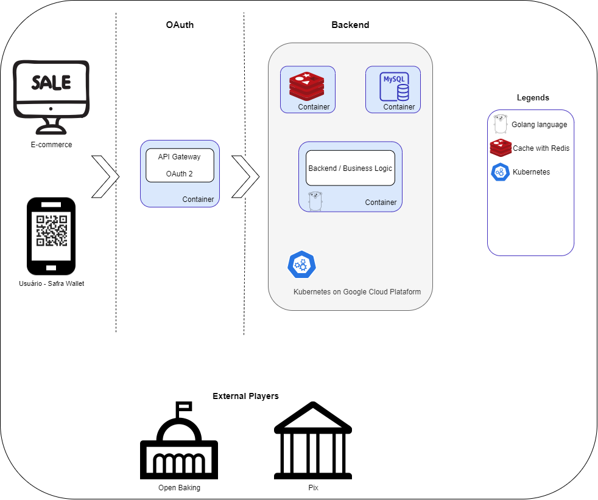

## 📝 Project


## Description
💳 This application aims to offer a new disruptive way to shop online.
  
[Demo video]()  

* Language:
  - [Golang](https://golang.org/)  

* Arquitetura técnica:
  - 

* Database:
  - MySQL


## ❗ Requirements
To run this application you have to install (if you don't have already installed) the follow programs:
* <b>In your computer</b>:
   * Docker 🐳 [click here](https://docs.docker.com/get-docker/)
<br>

## ▶️ Start application

#### Permissions first:  

* For <b>Unix</b> enviroment, run the comand:  
<b>```chmod +x .docker/entrypoint.sh```</b>  

* For <b>Windows</b> enviroment, run the comand:   
<b>```dos2unix +x .docker/entrypoint.sh```</b>  

### 💻 Start:
* Now, in your terminal, you can run:  <br>
<b>```docker-compose up```</b>

<br><br>
